# Blog_Project

## 1. 목표와 기능

### 1.1 목표
 

* Django 이해 및 공부
* BLOG 기능 구현

### 1.2 기능
* 블로그 목록 조회: 등록된 블로그 목록을 표시하여 사용자가 선택할 수 있도록 함
* 블로그 상세 조회: 선택한 블로그의 상세 정보를 표시하여 사용자에게 제공
* 포스트 작성: 사용자가 블로그에 새로운 포스트를 작성할 수 있도록 함
* 포스트 수정 및 삭제: 사용자가 작성한 포스트를 수정하거나 삭제할 수 있도록 함
* 댓글 및 대댓글 작성: 사용자가 포스트에 댓글 또는 대댓글을 작성할 수 있도록 함
* 댓글 수정 및 삭제: 사용자가 작성한 댓글을 수정하거나 삭제할 수 있도록 함
* 즐겨찾기: 사용자가 좋아하는 포스트를 즐겨찾기에 추가하거나 제거할 수 있도록 함

## 2. 개발 환경 및 배포 URL
### 2-1 개발환경
- Visual Studio Code(Django)

### 2-2 URL구조

### register 앱

| App       | URL                | Views Function | HTML File Name           | Note              |
|-----------|--------------------|----------------|--------------------------|-------------------|
| register  | `/signup/`         | `user_signup`  | `register/signup.html`   | 회원가입 페이지    |
| register  | `/login/`          | `user_login`   | `register/login.html`    | 로그인 페이지      |
| register  | `/logout/`         | `user_logout`  | `register/logout.html`   | 로그아웃 처리      |
| register  | `/profile/`        | `user_profile` | `register/profile.html`  | 사용자 프로필 페이지 |

### post 앱

| App       | URL             | Views Function | HTML File Name        | Note                 |
|-----------|-----------------|----------------|-----------------------|----------------------|
| post      | `/`             | `post_list`    | `post/post_list.html` | 메인 페이지           |
| post      | `/create/`      | `post_create`  | `post/post_create.html`| 게시글 생성 페이지   |
| post      | `/<int:pk>/`    | `post_detail`  | `post/post_detail.html`| 게시글 상세 페이지   |
| post      | `/<int:pk>/update/` | `post_update`| `post/post_update.html`| 게시글 수정 페이지   |
| post      | `/<int:pk>/delete/` | `post_delete`| `post/post_delete.html`| 게시글 삭제 페이지   |

## WBS

```mermaid
graph TD;
    A[프로젝트 기획]
    B[환경 설정]
    C[기본 기능 구현]
    D[프론트엔드 개발]
    E[테스트 및 디버깅]
    F[배포]
    G[유지 보수 및 업데이트]
    A --> A1[요구사항 분석]
    A --> A2[기능 명세 작성]
    A --> A3[데이터베이스 모델링]
    A --> A4[UI/UX 설계]
    A --> A5[프로젝트 일정 수립]
    B --> B1[가상 환경 설정]
    B --> B2[Django 설치]
    B --> B3[프로젝트 생성]
    C --> C1[사용자 인증 시스템 구현]
    C --> C2[블로그 모델 생성]
    C --> C3[블로그 CRUD 기능 구현]
    C --> C4[댓글 기능 구현]
    C --> C5[카테고리 및 태그 구현]
    C --> C6[검색 기능 구현]
    D --> D1[템플릿 작성]
    D --> D2[CSS 스타일링]
    D --> D3[JavaScript 추가 기능 구현]
    E --> E1[기능 테스트]
    E --> E2[디버깅 및 버그 수정]
    E --> E3[보안 검토]
    F --> F1[서버 구축]
    F --> F2[배포 설정]
    F --> F3[데이터베이스 마이그레이션]
    F --> F4[프로젝트 라이브 배포]
    G --> G1[사용자 피드백 수집]
    G --> G2[버그 수정 및 업데이트]
    G --> G3[추가 기능 개발 및 배포]
```

